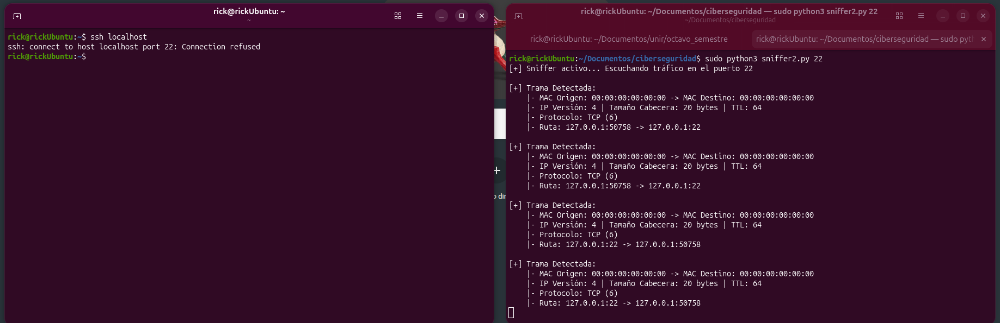

# 🛡️ MISIÓN 01: Sniffer de Red Bare-Metal & Filtro Dinámico de Capa 4

**Operador:** jorgerickdev
**Fecha:** Septiembre 2026  
**Entorno:** Ubuntu Linux (Bare-Metal)  
**Lenguaje:** Python 3 (Sin librerías de terceros / Sockets Puros)

---

## 🎯 1. El Objetivo (The Target)
Construir una herramienta de interceptación y análisis de tráfico de red en tiempo real a nivel de trama Ethernet e IP (Capa 2 y Capa 3), implementando un mecanismo de filtrado dinámico de puertos en la Capa de Transporte (Capa 4: TCP/UDP) sin depender de herramientas automatizadas como Wireshark, TShark o Scapy.

---

## 🛠️ 2. El Enfoque de Fricción (The Hard Way)
* **Sockets Crudos (`AF_PACKET`):** Se programó un socket a nivel de enlace de datos utilizando `socket.AF_PACKET` y `socket.SOCK_RAW`, obligando a la interfaz física a entregar tramas binarias sin procesar por el kernel.
* **Desempaquetado Binario a Mano:** Uso exclusivo del módulo `struct` para realizar operaciones de des-serialización de bytes binarios (`struct.unpack`) mapeando la estructura matemática de las cabeceras Ethernet (14 bytes) e IPv4 (20+ bytes).
* **Offset Dinámico de Capa 4:** Dado que el tamaño de la cabecera IP es variable (campo IHL), se calculó dinámicamente el punto exacto donde inicia la capa de transporte:
  $$\text{Offset} = 14 + (\text{IHL} \times 4)$$

---

## 🧠 3. La Trampa Anti-Intuición (System 2 Break)
* **La Fricción de Privilegios:** El primer instinto fue asumir que la falta de paquetes era un bug en el bucle de Python. La causa real fue la restricción del kernel de Linux sobre el modo promiscuo y el acceso a sockets raw por usuarios sin privilegios. Se resolvió configurando manualmente la interfaz física en modo promiscuo (`sudo ip link set dev eno1 promisc on`) y ejecutando bajo `sudo`.
* **Tráfico Loopback local vs. Físico:** Se identificó que las peticiones locales (ej. `ssh localhost`) circulan con direcciones MAC nulas (`00:00:00...`) sobre la interfaz `lo`, mientras que las peticiones externas reflejan las direcciones MAC físicas de la tarjeta `eno1` y del gateway.

---

## 📸 4. Evidencia Operativa
* **Filtrado en Puerto 80 (HTTP):** Interceptación bidireccional de tráfico entre el host local (`192.168.100.21`) y la infraestructura de Canonical (`91.189.91.57`), registrando la degradación del TTL de 64 a 43 (21 saltos de router).
* **Filtrado en Puerto 22 (SSH):** Captura en tiempo real del intento de apertura de socket TCP (handshake SYN/RST-ACK) desencadenado por el cliente OpenSSH local.

* **Filtrado en Puerto 80 (HTTP):** Interceptación bidireccional...

---

## 🛡️ 5. La Mitigación (Blue Team & OpSec)
* **OpSec:** El modo promiscuo en interfaces de red debe desactivarse inmediatamente al concluir la auditoría (`sudo ip link set dev eno1 promisc off`) para prevenir el sobrecalentamiento del adaptador por sobreprocesamiento de tramas broadcast y evitar técnicas de detección pasiva de sniffers vía latencia ICMP.
* **Detección:** El uso de raw sockets en entornos corporativos debe ser auditado mediante reglas eBPF o Auditd que alerten cuando un proceso sin firma intente abrir sockets con la familia `AF_PACKET`.

