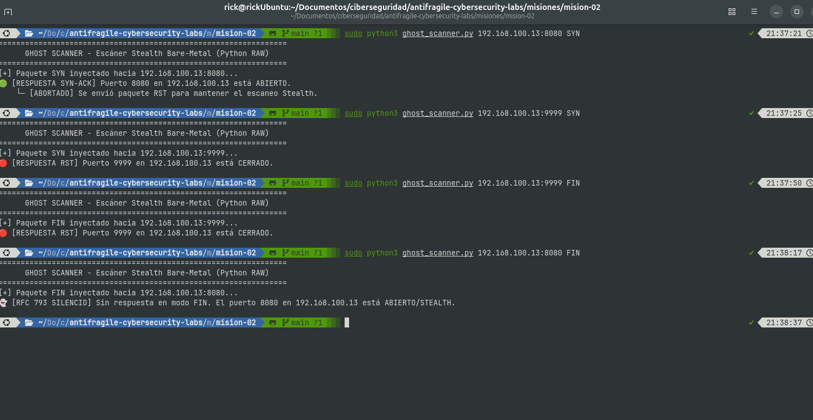

# 👻 MISIÓN 02: El Escáner Fantasma (SYN Stealth & FIN Scanner)

**Operador:** jorgerickdev  
**Fecha:** Septiembre 2026  
**Entorno:** Ubuntu Linux (Bare-Metal) vs. Android (Termux) & Windows 11  
**Lenguaje:** Python 3 (Sockets RAW Puros / Sin Scapy)

---

## 🎯 1. El Objetivo (The Target)
Construir una herramienta de escaneo activo de puertos a bajo nivel que determine el estado de un servicio objetivo (**ABIERTO**, **CERRADO** o **FILTRADO**) sin completar el apretón de manos (*Handshake*) de 3 vías de TCP, logrando un escaneo "Stealth" (Half-Open) e implementando la evasión de firewalls sin estado mediante paquetes `FIN` aislados (RFC 793).

---

## 🛠️ 2. El Enfoque de Fricción (The Hard Way)
* **Forjado Binario de Cabecera TCP (`struct.pack`):** Construcción manual bit a bit de la cabecera TCP de 20 bytes, manipulando el byte de banderas (`0x02` para SYN, `0x01` para FIN, `0x04` para RST).
* **Cálculo de Checksum TCP (RFC 1071):** Implementación del algoritmo de suma de comprobación de Internet calculada sobre una **Pseudo-Cabecera IP** de 12 bytes + la cabecera TCP en formato Big-Endian (`!HHLLBBHHH`).
* **Socket RAW de Inyección (`AF_INET`, `SOCK_RAW`, `IPPROTO_TCP`):** Inyección directa de tramas TCP en el stack de red del kernel, omitiendo las capas superiores de abstracción del sistema operativo.

---

## 🧠 3. La Trampa Anti-Intuición (System 2 Break)
* **El Aborto Inmediato (SYN Stealth):** Al recibir la respuesta `SYN-ACK` (`0x12`) del servidor objetivo, en lugar de responder con un `ACK` (que completaría la conexión y generaría un log de aplicación en el servidor), el script dispara un paquete `RST` (`0x04`). Esto cancela la sesión a nivel de transporte antes de que la capa de aplicación (ej. HTTP en Termux) registre la IP atacante.
* **La Regla del Silencio RFC 793 (FIN Scan):** En escaneos `FIN` contra sistemas basados en Linux/BSD, un puerto **ABIERTO** ignora el paquete `FIN` no solicitado y no responde nada (silencio/timeout). Un puerto **CERRADO** responde inmediatamente con un `RST`. La intuición convencional sugiere que "sin respuesta = error"; la lógica de bajo nivel demuestra que en escaneos `FIN`, **el silencio confirma que el puerto está abierto**.

---

## 📸 4. Evidencia Operativa

* **Inyección SYN contra Termux (`192.168.100.13:8080`):** Intercepción en tiempo real del paquete `SYN-ACK` de la tablet y envío automático del paquete `RST` para abortar la sesión.

---

## 🛡️ 5. La Mitigación (Blue Team & OpSec)
* **Blue Team:** Los escaneos Half-Open (SYN) no generan logs a nivel de aplicación (Nginx, Apache, SSH), pero son fácilmente detectables por Sistemas de Detección de Intrusos (IDS/IPS) como **Snort** o **Suricata** mediante la detección de anomalías en la tasa de paquetes `RST` sin flujo TCP previo.
* **Evasión / Firewalling:** Los firewalls con estado (*Stateful Inspection*) bloquean paquetes `FIN` aislados que no pertenecen a una tabla de conexiones activas previamente establecida (`ESTABLISHED`), neutralizando el escaneo FIN stealth.

